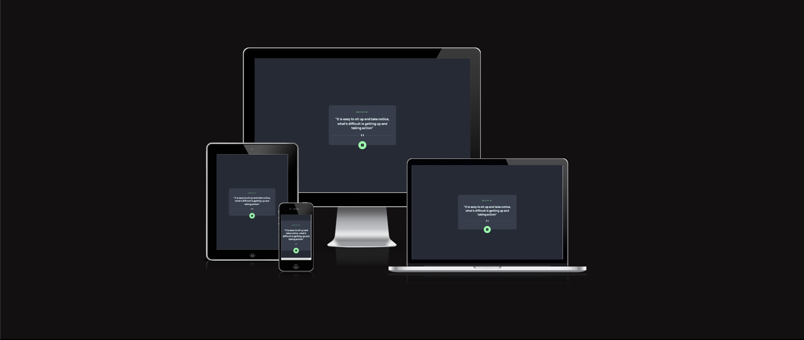

# Frontend Mentor - Advice generator app solution

This is a solution to the [Advice generator app challenge on Frontend Mentor](https://www.frontendmentor.io/challenges/advice-generator-app-QdUG-13db). Frontend Mentor challenges help you improve your coding skills by building realistic projects.

## Table of contents

- [Frontend Mentor - Advice generator app solution](#frontend-mentor---advice-generator-app-solution)
  - [Table of contents](#table-of-contents)
  - [Overview](#overview)
    - [The challenge](#the-challenge)
    - [Screenshot](#screenshot)
    - [Links](#links)
    - [Built with](#built-with)
    - [What I learned](#what-i-learned)
    - [Continued development](#continued-development)
  - [Author](#author)

## Overview

### The challenge

Users should be able to:

- View the optimal layout for the app depending on their device's screen size
- See hover states for all interactive elements on the page
- Generate a new piece of advice by clicking the dice icon

### Screenshot



### Links

- Solution URL: [Solution URL here](https://github.com/kostyafarber/front-end-practice/tree/main/advice-generator-app-main)
- Live Site URL: [Live site URL](https://lighthearted-jelly-3b8d46.netlify.app/)

### Built with

- Semantic HTML5 markup
- CSS custom properties
- Flexbox
- CSS Grid
- Mobile-first workflow

### What I learned

Learnt a lot of `Promises` and `await`.

```js
async function getAdvice(url) {
    const res = await fetch(url)
    let obj = await res.json()
    return obj;
};
```

### Continued development

Keep on learning JavaScript and how to interact with various APIs!

## Author

- Website - [Kostya Farber](https://kostyafarber.github.io/)
- Frontend Mentor - [@kostyafarber](https://www.frontendmentor.io/profile/kostyafarber)
- Twitter - [@FarberKostya](https://www.twitter.com/FarberKostya)

