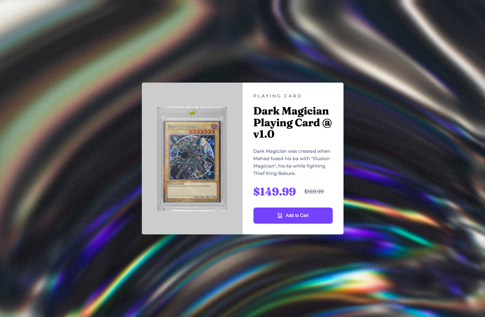

# Frontend Mentor - Product preview card component solution

This is a solution to the [Product preview card component challenge on Frontend Mentor](https://www.frontendmentor.io/challenges/product-preview-card-component-GO7UmttRfa). Frontend Mentor challenges help you improve your coding skills by building realistic projects. 

## Table of contents

- [Frontend Mentor - Product preview card component solution](#frontend-mentor---product-preview-card-component-solution)
  - [Table of contents](#table-of-contents)
  - [Overview](#overview)
    - [The challenge](#the-challenge)
    - [Screenshot](#screenshot)
    - [Links](#links)
  - [My process](#my-process)
    - [Built with](#built-with)
    - [What I learned](#what-i-learned)
    - [Continued development](#continued-development)
    - [Useful resources](#useful-resources)
  - [Author](#author)

**Note: Delete this note and update the table of contents based on what sections you keep.**

## Overview

### The challenge

Users should be able to:

- View the optimal layout depending on their device's screen size
- See hover and focus states for interactive elements

### Screenshot



### Links

- Solution URL: [Live site URL](https://elaborate-twilight-8e997d.netlify.app/)

- Live Site URL: [Solution URL](https://www.frontendmentor.io/solutions/product-preview-using-reactscss-custom-product-trying-to-use-bem-GunR8ITQO3)

## My process

### Built with

- Semantic HTML5 markup
- CSS custom properties
- Flexbox
- CSS Grid
- Mobile-first workflow
- [React](https://reactjs.org/) - JS library

### What I learned

This was my first project using `React`. It was a bit overkill for this size of project but I wanted to learn how to use this framework. It was a lot of fun!

I learnt about passing props and objects to components. Really neat way to make the web more reusable.

```js
function App() {
  const product = {
    productType: 'playing card', 
    productName: 'Farber Playing Card 2022 Mint', 
    productDesc: `A floral, solar and voluptuous inerpretation composed by Oliver
                  Polge, Perfumer-Creator for the House of CHANEL.`, 
    price: "$149.99",  
    priceReduced: "$169.99"
  }

  return (
    <Preview product = {product} />
  );
}
```

### Continued development

Keep practising the bread and butter of HTML5/CSS and keep on learning how to use `React`.

### Useful resources

- [React Course](https://www.youtube.com/watch?v=Dorf8i6lCuk&ab_channel=Academind) - This awesome course on React is great starting point to leanr the basics!


## Author

- Website - [Kostya Farber](https://kostyafarber.github.io/)
- Frontend Mentor - [@kostyafarber](https://www.frontendmentor.io/profile/kostyafarber)
- Twitter - [@FarberKostya](https://twitter.com/FarberKostya)
