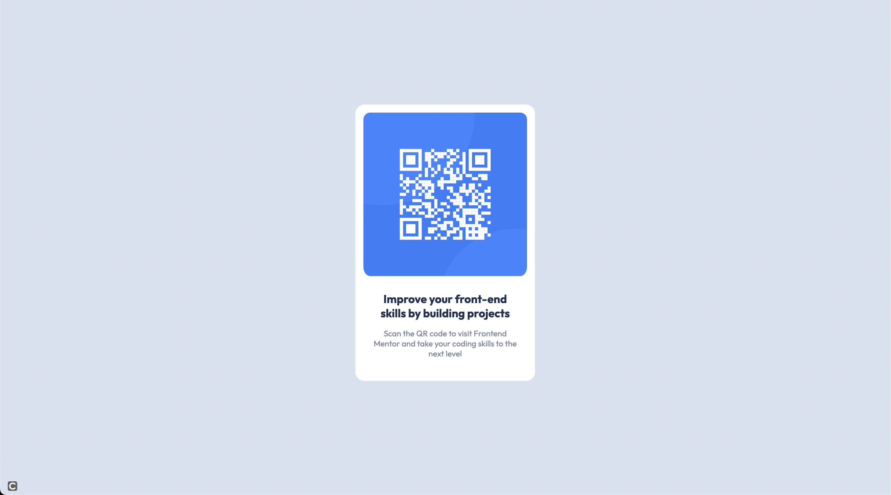

# Frontend Mentor - QR code component solution

This is a solution to the [QR code component challenge on Frontend Mentor](https://www.frontendmentor.io/challenges/qr-code-component-iux_sIO_H). Frontend Mentor challenges help you improve your coding skills by building realistic projects. 

## Table of contents

- [Overview](#overview)
  - [Screenshot](#screenshot)
  - [Links](#links)
- [My process](#my-process)
  - [Built with](#built-with)
  - [What I learned](#what-i-learned)
  - [Continued development](#continued-development)
  - [Useful resources](#useful-resources)
- [Author](#author)
- [Acknowledgments](#acknowledgments)

**Note: Delete this note and update the table of contents based on what sections you keep.**

## Overview

### Screenshot



## My process
Pretty standard process. Start structuring the HTML first and then use Sass to write the CSS.
### Built with

- Semantic HTML5 markup
- CSS custom properties
- Flexbox
### What I learned

Strengthing my knowledge of the box-model and how `box-sizing` impacts margins and padding.

Using variables (thank god) and using shorthand padding.

```scss
$font: Outfit;
```
```scss
.qr-code-image {
    max-width: 100%;
    width: 100%;
    border-radius: 25px;
    padding: 0.85em 0.85em 0.60em 0.85em;
}
```

### Continued development

Continue focusing on the general workflow of a front-end project. Being able to center things properly and responsive design.

### Useful resources

- [flexbox](https://css-tricks.com/snippets/css/a-guide-to-flexbox/) - This helped me understand flex boxes.
## Author

- Website - [https://kostyafarber.github.io/](https://kostyafarber.github.io/)
- Frontend Mentor - [@kostyafarber](https://www.frontendmentor.io/profile/kostyafarber)

