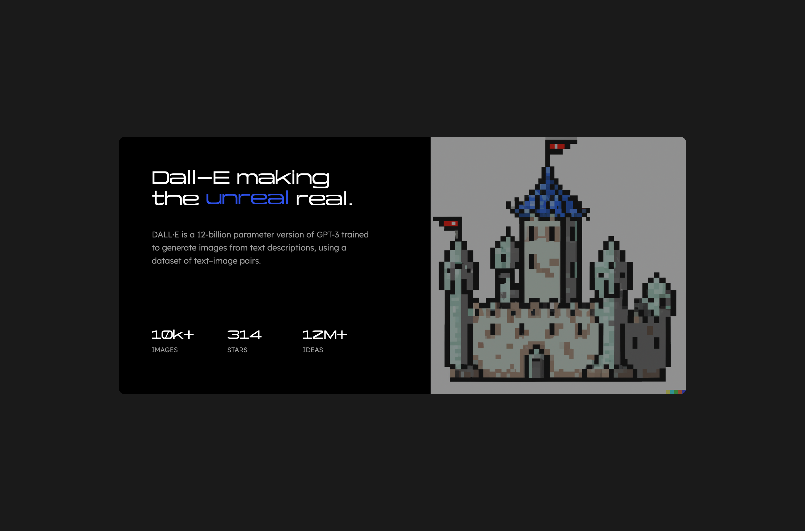

# Frontend Mentor - Stats preview card component solution

This is a solution to the [Stats preview card component challenge on Frontend Mentor](https://www.frontendmentor.io/challenges/stats-preview-card-component-8JqbgoU62). Frontend Mentor challenges help you improve your coding skills by building realistic projects. 

## Table of contents

- [Frontend Mentor - Stats preview card component solution](#frontend-mentor---stats-preview-card-component-solution)
  - [Table of contents](#table-of-contents)
  - [Overview](#overview)
    - [The challenge](#the-challenge)
    - [Screenshot](#screenshot)
    - [Links](#links)
  - [My process](#my-process)
    - [Built with](#built-with)
    - [What I learned](#what-i-learned)
    - [Continued development](#continued-development)
    - [Useful resources](#useful-resources)
  - [Author](#author)

## Overview

### The challenge

Users should be able to:

- View the optimal layout depending on their device's screen size

### Screenshot



### Links

- Solution URL: [Solution URL here](https://www.frontendmentor.io/solutions/stats-preview-card-built-using-flexbox-and-grid-IlxtUJjSdN)
- Live Site URL: [Live site URL here](https://fastidious-wisp-afb1f4.netlify.app/)

## My process

### Built with

- Semantic HTML5 markup
- CSS custom properties
- Flexbox
- CSS Grid
- Mobile-first workflow

### What I learned
I learnt a lot about using the grid layout in this one.

```css
.stats {
    display: grid;
    grid-template-columns: 1fr 1fr 1fr;
    grid-template-rows: 1fr 1fr;
    margin-top: 7.6rem;
    grid-row-gap: 0.3rem;
}
```

### Continued development

Keep on exploring creative ways to improve on these awesome challenges!
### Useful resources

- [Yapari Font](https://power-type.com/yapari/) - Awesome font I found on [behance](https://www.behance.com) for the title. Very futuristic feel.
- [Hover.css](https://www.example.com) - If you want some cool hover effects check this out.
## Author

- Website - [Kostya Farber](https://kostyafarber.github.io/)
- Frontend Mentor - [@kostyafarber](https://www.frontendmentor.io/profile/kostyafarber)
- Twitter - [@FarberKostya](https://www.twitter.com/FarberKostya)